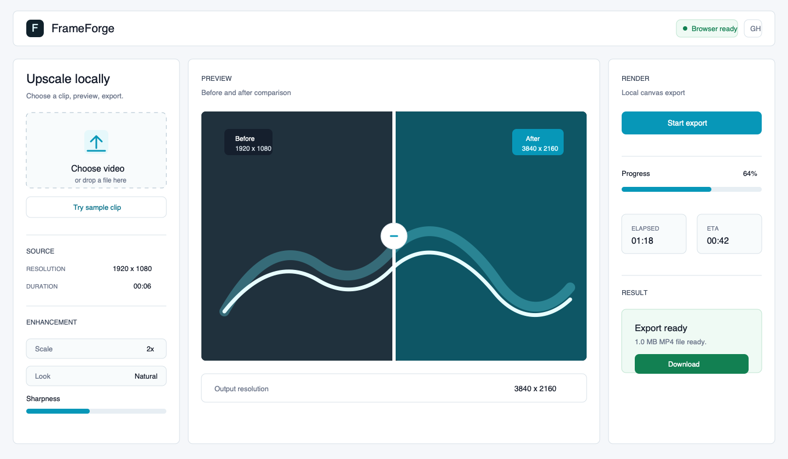
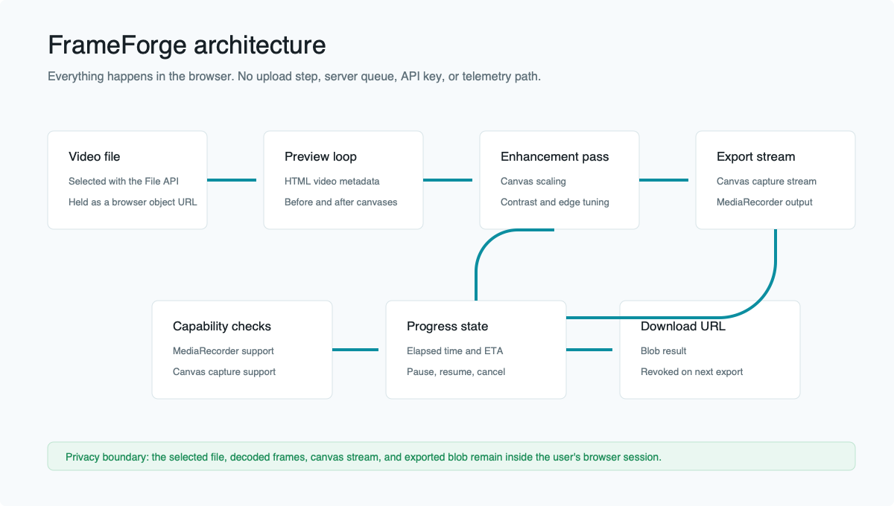

# FrameForge

FrameForge is a small local-first video upscaler that runs directly in the browser. Pick a clip, compare the original and enhanced frame, and export a new file without sending the source video anywhere.



## Why It Exists

Most quick video cleanup tasks do not need an account, a queue, or a desktop install. FrameForge keeps the workflow simple: open a video, tune the look, export the result, and close the tab. The tradeoff is intentional: it uses browser media APIs, so export support depends on what the user's browser can record.

## What It Does

- Loads videos through object URLs instead of reading the whole file into memory.
- Includes a generated sample clip so visitors can test the workflow immediately.
- Shows a draggable before/after preview using separate canvases.
- Exports an enhanced canvas stream with `MediaRecorder`.
- Checks browser support before export and shows recoverable errors in the UI.
- Keeps the code dependency-free so the deployed site is just static files.
- Avoids analytics, tracking scripts, hosted models, and server uploads.

## Architecture



The app is designed around a browser-only boundary. The selected file becomes a local object URL, the preview and export frames are rendered onto canvases, and the final result is created as a downloadable blob.

## Browser Support

FrameForge works best in current desktop browsers with `MediaRecorder` and `canvas.captureStream()` support. Chrome and Edge usually provide the smoothest export path. Some browsers may export WebM instead of MP4, and audio passthrough depends on whether the browser exposes audio tracks from the source video stream.

The app checks these capabilities at runtime. If a browser cannot record the enhanced canvas, the UI stays readable and explains what is missing instead of hanging during export.

## Local Development

```bash
npm run check
python3 -m http.server 4173
```

Then open `http://localhost:4173`.

No install step is required because the project has no runtime or build dependencies. The `build` script copies the static site into `dist/`, which is what GitHub Pages deploys.

## Deployment

The repository includes a GitHub Actions workflow at `.github/workflows/pages.yml`. On every push to `main`, it:

1. Builds the static site into `dist/`.
2. Checks for accidental local filesystem paths or stale project references.
3. Publishes the result with GitHub Pages.

The deployed site is also smoke-tested manually after publish by loading the live URL, checking for missing asset requests, and running a short generated clip through the export path.

## Notes

FrameForge records exports in real time. A two-minute source video takes roughly two minutes to export, plus whatever time the browser needs to draw enhanced frames. For long or high-resolution clips, use a shorter test export first and keep the tab visible while rendering.
